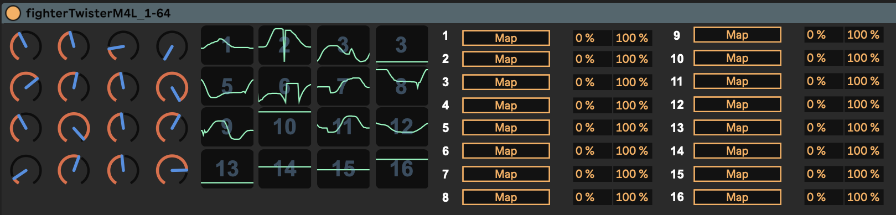

# controller / gesture looper
for DJTechTools Midi Fighter Twister and max4live

- fighterTwisterM4L_1-64.amxd - max4live device for the first two banks of knobs on the Twister
- fighterTwisterM4L_65-127.amxd - max4live device for banks 3 and 4
- fighterTwisterM4L-all.amxd - max4live device for all the banks of knobs at once
- fighterTwisterM4L.mfs - mapping to be sent to Midi Fighter Twister via Midi Fighter Utility (save your config!)

# how to use

- add this device to an empty midi track
- set track input and output to midi fighter twister, set midi channel to 1
- twist knobs, map parameters
- recording mode: press and hold any knob and twist
- upon release, playback begins immediately. time your loops well!
- visual feedback is provided both in ableton and on the hardware itself
- any side button on the right side: next bank
- any side button on the left side: previous bank
- short click on the knob clears buffer
- buffer lentgh: 20 seconds

made by humans (no llms)
